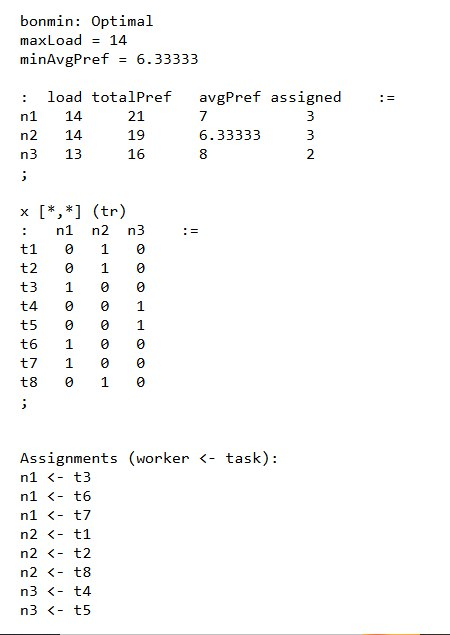

## Результаты второй фазы

Во второй фазе проекта была выполнена следующая работа:

1. **Проведена декомпозиция проекта на 10 отдельных задач**  
   Подробный перечень задач содержится в файле: [Task decomposition for phase 3](/phase_2/Task%20decomposition%20for%20phase%203)

2. **Выполнена оценка трудоёмкости каждой задачи**  
   Оценка выполнена в формате таблицы и находится в файле: [Оценка задач.xlsx](/phase_2/Оценка%20задач.xlsx)

3. **Разработана программа для распределения негрупповых задач между участниками команды**  
   Программа автоматически распределяет задачи с учётом их оценочной сложности и доступности исполнителей.  
   Ниже приведено изображение с результатом работы программы:  

   
